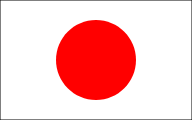
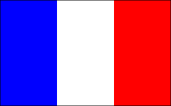
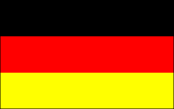
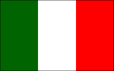

# Kodowanie z piratami

+++

## Ahoj! :)

### Piracka załoga Relativity:

Note:
- Powitanie
- Przedstawiamy załogę

+++

## Jakie jest Twoje imię?

Note:
- imię
- ulubiony kolor

+++

## Niespodzianka!

+++

## Piracki plan

1. podstawy programowania (40 min)
1. demo 1 (5 min)
1. piracka siesta (5 min)
1. dalsza przygoda z programowaniem (40 min)
1. demo 2 (5 min)
1. pożegnanie

Note:

---

### Co to jest *programowanie*?

Note:
- wszystkie skojarzenia, pomysły, itd.

+++

#### HP Gif here

Note:
- TODO!
- Tyle lat - wciąż nie wiem, jak coś zrobić
- Dużo praktyki i cierpliwości
- To zaowocuje - niesamowite efekty

---

### Żagle na maszt!

### Wypływamy!

Note:
- gif, obrazek - wypływający okręt

+++

### Język programowania: 


[Strona internetowa](https://www.pyret.org/)

Edytor - [https://code.pyret.org](https://code.pyret.org)

Note:
- **otwórzmy przeglądarkę!!**
- opis edytora
- język angielski!
- komunikaty błędów
- załoga pomoże

---

## Lekcja 1

### Dane

Note:
- komputery rozróżniają różne typy danych
- zeszyt - piszecie tekst i liczby tak samo

+++

#### String - tekst, napis

```
"Tekst na dobry początek"
"Drugi string"
```

+++

#### Liczby

```
1
2
3
```

Note:
- komputer to też zaawansowany kalkulator
- kto wie co to jest kalkulator?

+++

#### Działania

```
2 + 3
8 * 9
10 - 7
4 / 2
```

+++ 

#### Zadania

1. Napisz swoje imię jako string.
1. Ile masz lat? Napisz liczbę.
1. Jaki będzie wynik działania:

   `23424234 * 345345345` ?
1. &#42; Oblicz, ile sekund mieści się w godzinie?

+++

#### Podsumowanie

- różne typy danych
- znamy 2 typy danych:

  - string, czyli napis
  - liczby

- komputer potrafi liczyć
- zna działania takiej jak: \+, \-, \*, /

Note:
- w programowaniu występują różne typy danych
- 

---

## Lekcja 2
### Rysowanie

Note:
- otwórz edytor, pokaż przykład od razu

+++

### Komentarz

- wiadomość dla programisty
- zapisana w kodzie
- ukryta dla komputera
- komputer ją ignoruje

+++

### Komentarz - przykład

```
# To jest komentarz
"A to nie"
7
324 # Tutaj też może być komentarz
```

+++

### Biblioteka

+++

#### TODO obrazek biblioteki tutaj

### ???

Note:
- co to jest biblioteka?
- kto tam chodzi, co robi?
- student musi napisać wypracowanie
- bierze kilka innych książek
- czyta i składa swoją pracę z różnych cytatów i fragmentów

+++

Biblioteka do rysowania obrazków: `image`

Trzeba rzucić zaklęcie: `include`

Wtedy możemy korzystać z wszystkich funkcji w bibliotece:

```
include image

star
```

+++

### Funkcja

- magiczne pudełko/zwierzątko
- trzeba je nakarmić
- wtedy coś robi, albo daje rezultat (daj głos!)
- przyjumje ściśle określone argumenty (jedzenie)

Note:
- obrazek funkcji?

+++

### TODO obrazek funkcji z objaśnieniami

+++

#### Wymyślmy kilka 

#### przykładowych funkcji

Note:
- id
- const
- +1
- String.reverse

---

## Lekcja 3
### Szukamy bugów

Note:
- TODO dodać obrazek buga ;)
- Otwórz L3.arr w przeglądarce!

---

## Lekcja 4
### Nowe kształty

Note:
- widzę ląd!
- na horyzoncie wyłaniają się nowe kształty

+++

#### Geometryczny Quiz

+++

Koło

@ul[shapes]

- Circle

@ulend

+++

Trójkąt

@ul[shapes]

- Triangle

@ulend

+++

Prostokąt

@ul[shapes]

- Rectangle

@ulend

+++

Kwadrat

@ul[shapes]

- Square

@ulend

---

## Lekcja 5
### Łączymy obrazki

Note:
- TODO obrazek - klocki lego
- Co zwracają funkcje circle, square, triangle, itp. ?
- Poznamy funkcję, która łączy dwa obrazki w jeden, nowy obrazek

+++

#### Funkcja overlay

```
include image

overlay(obrazek1, obrazek2)
```

---

## Lekcja 6
### Obrazki z internetu

+++

Funkcja `image-url` zwraca obrazek z internetu.

Trzeba jej podać adres obrazka,

czyli argument typu *string*.

```
include image

image-url("https://www.obrazki.com/obrazek.png")
```

+++

Funkcja `scale` zmienia (skaluje) rozmiar obrazka.

Przekazujemy jej dwa argumenty:

- ułamek (czyli liczbę)
- obrazek, którego rozmiar zmieniamy

+++

#### Funkcja scale - przykład

```
include image

scale(0.5, circle(100, "solid", "green"))
```

+++

Link do obrazka:

[https://goo.gl/sGQheU](https://goo.gl/sGQheU)

---

## Lekcja 7
### Obrazki obok siebie

+++

Funkcja `beside` układa 2 obrazki obok siebie.

Zwraca ułożone obrazki, jako nowy obrazek.

```
include image

beside(obrazek1, obrazek2)
```

---

## Lekcja 8
### Obrazki nad sobą

+++

Funkcja `above` układa 2 obrazki nad sobą.

Zwraca ułożone obrazki, jako nowy obrazek.

```
include image

above(obrazek1, obrazek2)
```

---

## Lekcja 9
### Rysujemy flagi

+++






