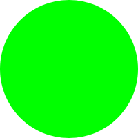

# Kodowanie&nbsp;z
# piratami


+++

## Piracka załoga


## Ahoj! @fa[smile-o]


Note:
- Powitanie
- Przedstawiamy załogę

+++

## Jakie jest Twoje imię?

Note:
- imię
- ulubiony kolor

+++

## Piracki plan

- Podstawy programowania (40 min)
- Demo 1 (5 min)
- Piracka siesta (5 min)
- Dalsza przygoda z programowaniem (40 min)
- Quiz (10 min)
- Demo 2 (5 min)
- Pożegnanie

---

### Co to jest 

<h3>
  <span class="p">p</span>
  <span class="r">r</span>
  <span class="o">o</span>
  <span class="g">g</span>
  <span class="r">r</span>
  <span class="a">a</span>
  <span class="m">m</span>
  <span class="o">o</span>
  <span class="w">w</span>
  <span class="a">a</span>
  <span class="n">n</span>
  <span class="i">i</span>
  <span class="e">e</span>
  <span>?</span>
</h3>

Note:
- wszystkie skojarzenia, pomysły, itd.

+++
@title[Magia]


Note:
- Tyle lat - wciąż nie wiem, jak coś zrobić
- Dużo praktyki i cierpliwości
- To zaowocuje - niesamowite efekty
- Pokażemy Wam prawdziwe programowanie
- Takie, jakiego używamy w pracy na co dzień

---?image=presentation/set_sails.jpg&size=50% auto
@title[Zaczynamy]

---?image=presentation/set_sails.jpg&size=50% auto

@transition[fade]

### @color[white](Żagle na maszt!)

+++

### Język programowania: 


[Strona internetowa](https://www.pyret.org/)

Edytor - [https://code.pyret.org](https://code.pyret.org)

Note:
- **otwórzmy przeglądarkę!!**
- opis edytora
- Google Drive - integracja
- język angielski!
- komunikaty błędów
- załoga pomoże

---

## Lekcja 1

### Dane

Note:
- komputery rozróżniają różne typy danych
- zeszyt - piszecie tekst i liczby tak samo

+++

#### String - tekst, napis

```
"Tekst na dobry początek"
"Drugi string"
```

+++

#### Liczby

```
1
2
3
```

Note:
- komputer to też zaawansowany kalkulator
- kto wie co to jest kalkulator?

+++

#### Działania

```
2 + 3
8 * 9
10 - 7
4 / 2
```

+++ 

#### Zadania

1. Napisz swoje imię jako string.
1. Ile masz lat? Napisz liczbę.
1. Jaki będzie wynik działania:

   `1234 * 3456` ?
1. &#42; Oblicz, ile sekund mieści się w godzinie?

+++

#### Podsumowanie

- istnieją różne typy danych
- poznaliśmy 2 typy danych:

  - string, czyli napis
  - liczby

- komputer potrafi liczyć
- zna działania takiej jak: \+, \-, \*, /

Note:
- w programowaniu występują różne typy danych
- 

---

## Lekcja 2
### Rysowanie

Note:
- otwórz edytor, pokaż przykład od razu

+++

### Komentarz

- wiadomość dla programisty
- zapisana w kodzie
- ukryta dla komputera
- komputer ją ignoruje

+++

### Komentarz - przykład

```
# To jest komentarz
"A to nie"
7
324 # Tutaj też może być komentarz
```

+++

### Biblioteka (library)


Note:
- co to jest biblioteka?
- kto tam chodzi, co robi?
- student musi napisać wypracowanie
- bierze kilka innych książek
- czyta i składa swoją pracę z różnych cytatów i fragmentów

+++
@title[image]

Biblioteka do rysowania obrazków: @css[orange](`image`)

Trzeba rzucić zaklęcie: @css[orange](`include`)

Wtedy możemy korzystać z wszystkich funkcji w bibliotece:

```
include image

star
```

+++

### Funkcja

- magiczne pudełko
- trzeba do niego coś włożyć (argumenty)
- wtedy coś robi, daje rezultat (np. obrazek)

Note:
- prezentacja pudełka

+++

### Funkcja - przykład

```
include image

star(50, "solid", "red") 
# ^ funkcja zwraca obrazek gwiazdy
```

+++
@title[Przykładowe funkcje]

Wymyślmy kilka 

przykładowych funkcji!

Note:
- id
- const
- +1
- String.reverse

+++

### Podusmowanie

- komputer ignoruje komentarze
- komentarz jest dla programisty
- biblioteki to zbiory funkcji
- funkcja potrafi coś "zrobić", obliczyć
- funkcja przyjmuje argumenty i zwraca wyniki

---

## Lekcja 3
### Szukamy bugów


Note:
- Co to jest bug?
- Kornik!!
- Otwórz L3.arr w przeglądarce!

+++

### Podsumowanie
#### Najczęstsze błędy (bugi):

- brak nawiasu
- brak przecinka
- brak cudzysłowu
- zły typ danych
- zła liczba argumentów dla funkcji

---

## Lekcja 4
### Nowe kształty

Note:
- widzę ląd!
- na horyzoncie wyłaniają się nowe kształty

+++

#### Geometryczny Quiz

+++
@title[Koło]

Koło



@ul[shapes]

- Circle

@ulend

+++
@title[Trójkąt]

Trójkąt


@ul[shapes]

- Triangle

@ulend

+++
@title[Prostokąt]

Prostokąt


@ul[shapes]

- Rectangle

@ulend

+++
@title[Kwadrat]

Kwadrat


@ul[shapes]

- Square

@ulend

+++

### Podsumowanie

W bibliotece @css[orange](`image`) znajduje się wiele przydatnych funkcji do rysowania:

- `circle`
- `triangle`
- `square`
- `rectangle`
- `text`
- ...

---

## Lekcja 5
### Łączymy obrazki

Note:
- **klocki lego** - przykład
- Co zwracają funkcje circle, square, triangle, itp. ?
- Poznamy funkcję, która łączy dwa obrazki w jeden, nowy obrazek

+++

#### Funkcja overlay

```
include image

overlay(obrazek1, obrazek2)
```

+++

### Podsumowanie

- funkcja @css[orange](`overlay`) przyjmuje dwa argumenty - obrazki
- następnie nakłada te dwa obrazki na siebie
- zwraca nowy obraz, który składa się z danych dwóch obrazków

---

## Lekcja 6
### Obrazki z internetu

+++
@title[image-url]

Funkcja @css[orange](`image-url`) zwraca obrazek z internetu.

Trzeba jej podać adres obrazka,

czyli argument typu *string*.

```
include image

image-url("https://www.obrazki.com/obrazek.png")
```

+++
@title[scale]

Funkcja @css[orange](`scale`) zmienia (skaluje) rozmiar obrazka.

Przekazujemy jej dwa argumenty:

- ułamek (czyli liczbę)
- obrazek, którego rozmiar zmieniamy

+++

#### Funkcja scale - przykład

```
include image

scale(0.5, circle(100, "solid", "green"))
```

+++
@title[Ninja Cat]

Link do obrazka:

[https://goo.gl/sGQheU](https://goo.gl/sGQheU)

+++ 

### Podsumowanie

- funkcja @css[orange](`image-url`) zwraca obrazek pod danym adresem
- funkcja @css[orange](`scale`) zmienia rozmiar obrazka

---

## Lekcja 7
### Obrazki obok siebie

+++
@title[beside]

Funkcja @css[orange](`beside`) układa 2 obrazki obok siebie.

Zwraca ułożone obrazki, jako nowy obrazek.

```
include image

beside(obrazek1, obrazek2)
```

+++

### Zmienne

- są jak pudełko, do którego coś wkładamy
- nadajemy pudełku nazwę
- możemy potem wyciągnąć wartość z pudełka
  i użyć jej w innym miejscu

+++

### Zmienna - przykład

```
mojaZmienna = 7

3 + mojaZmienna # Wynik to 10
```

Note:
- zmienne przechowują nie tylko liczby
- przechowują dowolne dane
- nawet obrazki!

+++

### Podsumowanie

- funkcja @css[orange](`beside`) przyjmuje 2 obrazki

  - zwraca nowy obrazek, na którym 2 obrazki są ułożone obok siebie

- zmienne przechowują dowolne dane, żeby użyć ich w innych miejscach w programie

---

## Lekcja 8
### Obrazki nad sobą

+++
@title[above]

Funkcja @css[orange](`above`) układa 2 obrazki nad sobą.

Zwraca ułożone obrazki, jako nowy obrazek.

```
include image

above(obrazek1, obrazek2)
```

+++

### Ramka

Funkcja @css[orange](`frame`) rysuje prostokątną ramkę wokół dowolnego obrazka.

```
include image

frame(mojObrazek)
```

+++

### Podsumowanie

- funkcja @css[orange](`above`) przyjmuje 2 obrazki

  - zwraca nowy obrazek, na którym 2 obrazki są ułożone jeden nad drugim.

- funkcja @css[orange](`frame`) rysuje prostokątną ramkę wokół obrazka.

---

## Lekcja 9
### Rysujemy flagi

+++
@title[Flagi]


---

## Demo

Note:
- animacja
- mapa skarbów
- space invaders

---
@transition[none]

<div class="endslide">

  <h2 class="">Ada Lovelace</h2>

  <div class="row">

    

    <ul class="bio">
      <li>Żyła w XIX w.</li>
      <li>Interesowała się poezją i matematyką</li>
      <li>Była pierwszą programistką</li>
    </ul>

  </div>

</div>

---

## Quiz

1. [kahoot.it](kahoot.it)
1. Wprowadź kod PIN
1. Wpisz swoje imię (nick)

### Do dzieła!

---

## Pomyślnych wiatrów! @fa[smile-o]
@title[Pożegnanie]


